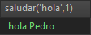
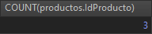

# Actividad de BBDD: Guiones

## Ejercicio 1:
En este primer ejercecio se pedía realizar una query en la cual se involucren un right join y dos variables.

Pues bien, esta es mi query:

~~~SQL
SET @nombre = 'Exotic Liquids';
SET @existencias = 15;

SELECT productos.nombreProducto FROM productos RIGHT JOIN proveedores 
			ON productos.IdProveedor = proveedores.IdProveedor
			WHERE proveedores.NombreCompañia = @nombre AND productos.UnidadesEnExistencia > @existencias;

~~~
Declaro dos variables las cuales almacenan el nombre de la compañía que provee el producto (@nombre) y el numero mínimo de existencias de producto(s) que quiero consultar de ese proveedor.

Las tablas involucradas son productos (left) y proveedores (right) de la base de datos Neptuno.

Esta query devuelve los nombres del producto que cumplen la condicion en el where.

## Ejercicio2
En el ejercicio 2 se pedía hacer una función que sirva para saludar. Ha de recibir 2 parámetros:
- **Tipo de saludo:** 'hola', 'adios', y si no es ninguno de esos dos, devuelve 'Saludos'
- **Id usuario:** ha de buscar por "id" en una tabla usuarios (es necesario que crees y que rellenes la tabla con datos). Si encuentra el id, la función devolverá el tipo de saludo y el nombre del usuario asociado a dicho id. Si no encuentra el id, la función devolverá  el tipo de saludo + "desconocido".

Este es mi código:
~~~SQL
DELIMITER $$
DROP FUNCTION if EXISTS saludar $$
CREATE FUNCTION saludar(TipoSaludo VARCHAR(20), id INT) RETURNS VARCHAR(20)
BEGIN 

	SET @saludo = (if(TipoSaludo != 'hola' AND TipoSaludo != 'adios','Saludos',TipoSaludo));
	SET @nombreUser = (SELECT nombre FROM usuario WHERE usuario.id = id);
	SET @result = (if(ISNULL(@nombreUser),
		 (CONCAT(@saludo," ",'desconocido')),(CONCAT(@saludo," ",@nombreUser))));
	RETURN @result;
	
END
$$
DELIMITER ;

SELECT saludar('hola',1);
~~~
Creo una funcion con los requisitos vistos antes, dentro de la funcion declaro 3 variables (@saludo, @nombreUser, @resultado), la primera va a almacenar 'hola','adios' o 'saludos' en función de si por parametro le pasamos 'hola' o 'adiós' o no le pasamos nada, en tal caso el if devolverá 'saludos'.

La segunda variable almacenara el resultado de la query del codigo, es decir, el nombre del usuario que tiene como id la pasada por parametro. Si no existe ningun usuario con esa id devolvera null.

Con la informacion de las anteriores variables podemos entender que se va a alamcenar en la variable @result. En esta variable se va a almacenar una cadena de texto. Si la variable @nombreUser tiene un nombre de un usuario almacenado lo concatenara a la variable @saludo antes vista, si el valor de @nombreUser es null concatenará a @saludo 'desconocido'.

Ahora supongamos que a la funcion le metemos como parametro 'hola' y el id 1, como es este caso.

Esto es lo que devolveria la query segun los datos de las tablas de la base de datos:

## Ejercicio 3
En el ejercicio 3 se pide realizar un procedimiento IN que permita hallar el número de productos a partir del nombre del proveedor en la base de datos Neptuno.

Aqui tenemos el procedimiento IN

~~~SQL
DELIMITER $$
DROP PROCEDURE if EXISTS numeroPedidos $$
CREATE PROCEDURE numeroPedidos(IN nombre VARCHAR(20))
BEGIN 		
	SELECT COUNT(productos.IdProducto) FROM productos 
						JOIN proveedores ON productos.IdProveedor = proveedores.IdProveedor
						WHERE proveedores.NombreCompañia = nombre GROUP BY proveedores.IdProveedor;
END
$$
DELIMITER ;
CALL numeroPedidos('Tokyo Traders');
~~~
Este procedimiento devuelve el numero de productos que tiene el proveedor en este caso llamado 'Tokyo Traders'. La query dentro del procedimiento selecciona todoas los productos de la tabla productos unida a la tabla proveedores donde productos.IdProveedor = proveedores.IdProveedor que tenga como proveedores a 'Tokyo Traders'. Para contar el numero de productos agrupamos por IdProveedor para que el SGBD nos cuente los productos que tengan como id de proveedor el de 'Tokyo Traders'.

Esta query con los parametro establecidos y los datos de las tablas en las que esteamos operando tiene como resultado:

Es decir 'Tokyo Traders' provee 3 productos.

## Ejercicio 4
En el ejercicio 4 se pide realizar un procedimiento OUT que muestre los precios del producto más caro y más barato de la base de datos Neptuno.

El código de la query es el siguiente:
~~~SQL
DELIMITER $$
DROP PROCEDURE if EXISTS precioUnidades $$
CREATE PROCEDURE precioUnidades(
OUT precioMinimo DECIMAL,
OUT precioMaximo DECIMAL
)
BEGIN

	SET precioMinimo = (SELECT MIN(productos.PrecioUnidad) FROM productos);
	SET precioMaximo = (SELECT MAX(productos.PrecioUnidad) FROM productos);
			
END
$$
DELIMITER ;
CALL precioUnidades(@precioMinimo,@precioMaximo);
SELECT @precioMinimo,@precioMaximo;
~~~
Este procedimiento es muy sencillo, doy valor a los dos parametros de salida del procedimiento realizando dos queries para el precio minimo selecciono con la funcion "MIN()" el precio minimo de todos los productos de la tabla producto. Con el precio maximo mas de lo mismo pero haciendo uso de la funcion MAX().

Esta query da como resultado:

## Ejercicio 5
Por último en el ejericio 5 debemos realizar Un procedimiento IN/OUT que permita vender productos de la base de datos Neptuno, pasándole el nombre del producto(IN) y la cantidad de unidades que se quieren vender(IN). Dicho procedimiento, no sólo restará las unidades en existencia de cada producto, sino que al ser llamado varias veces (para distintos productos) permitirá ir acumulando el beneficio de las ventas en una variable (OUT).

Este es mi código:
~~~SQL
DELIMITER $$
DROP PROCEDURE if EXISTS ventaProductos $$
CREATE PROCEDURE ventaProductos(
IN nombreProducto VARCHAR(20),
IN cantidadUnidades SMALLINT,
OUT beneficio DECIMAL
)
BEGIN

	UPDATE productos 
		SET productos.UnidadesEnExistencia =  productos.UnidadesEnExistencia - cantidadUnidades
		WHERE productos.NombreProducto = nombreProducto; 

	SET beneficio = (SELECT productos.PrecioUnidad 
							FROM productos WHERE productos.NombreProducto = nombreProducto) * cantidadUnidades;
		
	
END
$$
DELIMITER ;
CALL ventaProductos('Pez espada',2,@beneficiosVentas);
SELECT @beneficiosVentas;
~~~
Como parametros de entrada tenermos el nombre del producto que queremos vender y la cantidad que queremos vender y como parametro de salida el beneficio de las ventas. Dentro del procedimiento al vender el producto tenemos que actualizar el campo UnidadesEnExistencia de la tabla productos, y para esto hacemos uso de UPDATE[...] para actualizar el numero de UnidadesEnExistencia y restar las unidades que querems vener.

Despues hago una query para calcular el beneficio segun el numero de unidades que quiero vender del producto, que sera el beneficio economico final.

El resultado de esta query es:

